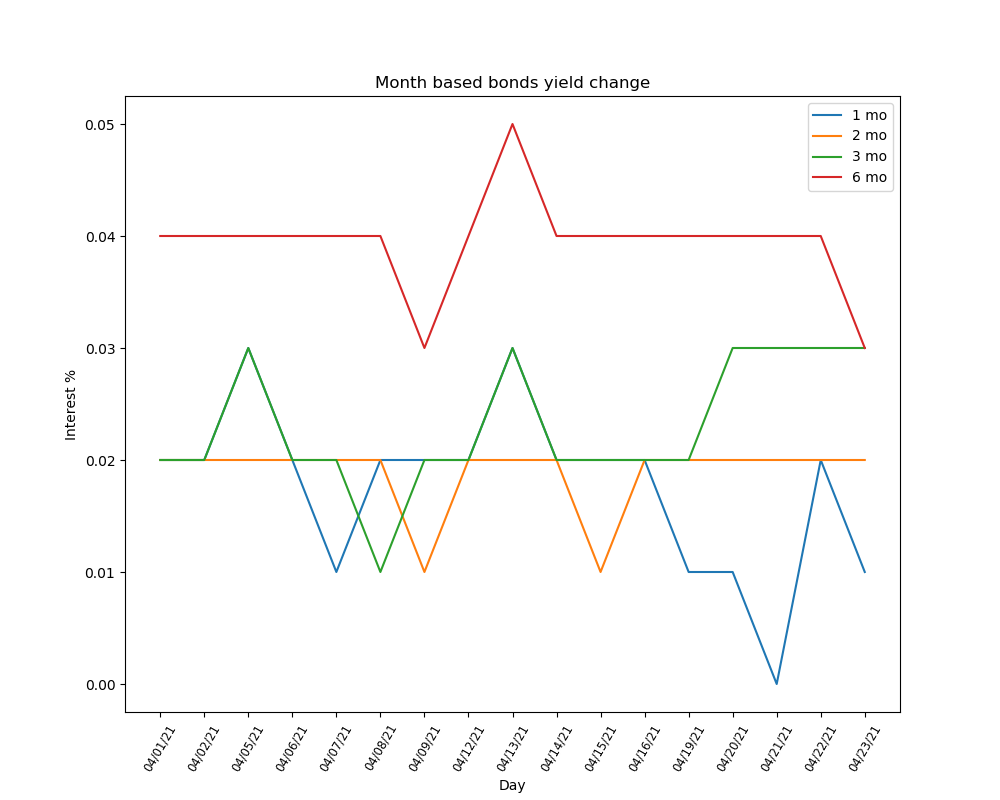
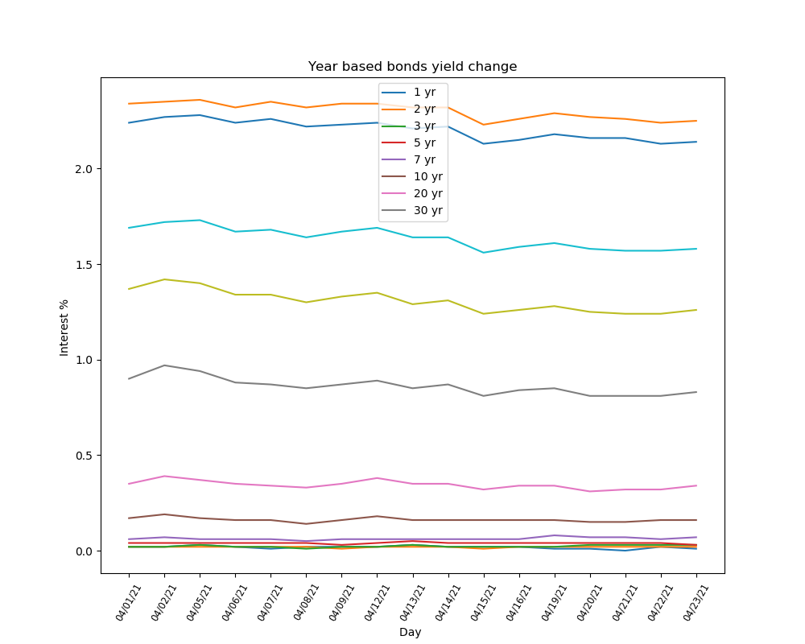

# Treasury Yield Curve Rates Project

This project scrapes data from the [U.S. Department of the Treasury](https://www.treasury.gov/resource-center/data-chart-center/interest-rates/Pages/TextView.aspx?data=yield)
and saves it to a database using [pandas](https://pandas.pydata.org) and creates charts on daily changes using [matplotlib](https://matplotlib.org/).

I also included a separate `cronjobs.py` file for automation of `script.py` on a week day basis.

To acomplish this I used [cronjobs](https://ostechnix.com/a-beginners-guide-to-cron-jobs/) and the [python-crontab](https://pypi.org/project/python-crontab/) library.

The back end and views are handled by [Django](https://www.djangoproject.com/) and database queries are handled by the [sqlite3](https://www.sqlite.org/index.html) python library.

**About Treasury Yield Curve Rates:** "These rates are commonly referred to as "Constant Maturity Treasury" rates, or CMTs. Yields are interpolated by the Treasury from the daily yield curve. This curve, which relates the yield on a security to its time to maturity is based on the closing market bid yields on actively traded Treasury securities in the over-the-counter market. These market yields are calculated from composites of indicative, bid-side market quotations (not actual transactions) obtained by the Federal Reserve Bank of New York at or near 3:30 PM each trading day. The CMT yield values are read from the yield curve at fixed maturities, currently 1, 2, 3 and 6 months and 1, 2, 3, 5, 7, 10, 20, and 30 years. This method provides a yield for a 10 year maturity, for example, even if no outstanding security has exactly 10 years remaining to maturity

# Contact me
[linkedin](https://www.linkedin.com/in/bryantnovas/)